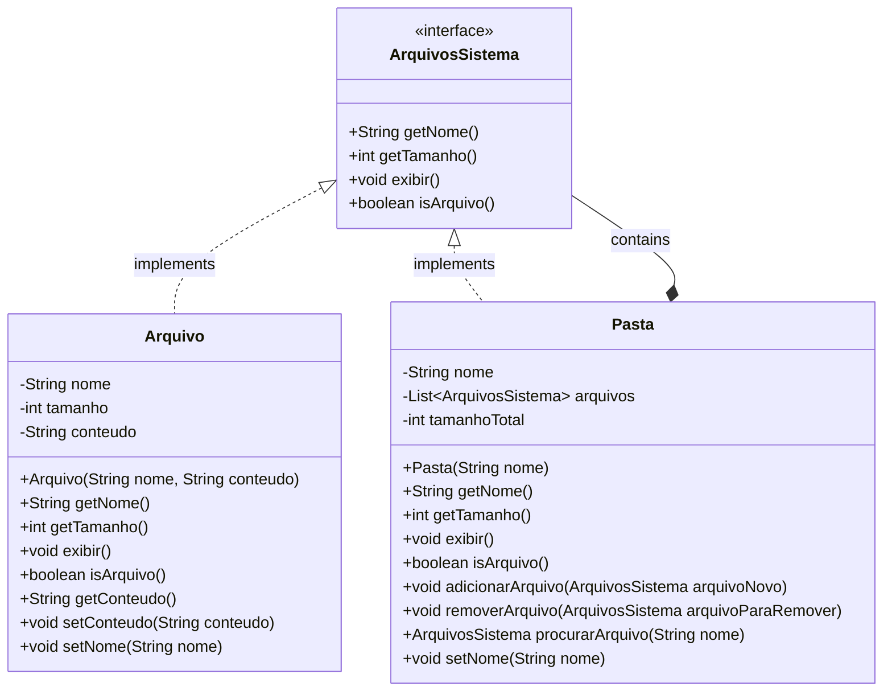

```mermaid
    classDiagram
    class ArquivosSistema {
        <<interface>>
        +String getNome()
        +int getTamanho()
        +void exibir()
        +boolean isArquivo()
    }

    class Arquivo {
        -String nome
        -int tamanho
        -String conteudo
        +Arquivo(String nome, String conteudo)
        +String getNome()
        +int getTamanho()
        +void exibir()
        +boolean isArquivo()
        +String getConteudo()
        +void setConteudo(String conteudo)
        +void setNome(String nome)
    }

    class Pasta {
        -String nome
        -List~ArquivosSistema~ arquivos
        -int tamanhoTotal
        +Pasta(String nome)
        +String getNome()
        +int getTamanho()
        +void exibir()
        +boolean isArquivo()
        +void adicionarArquivo(ArquivosSistema arquivoNovo)
        +void removerArquivo(ArquivosSistema arquivoParaRemover)
        +ArquivosSistema procurarArquivo(String nome)
        +void setNome(String nome)
    }

    ArquivosSistema <|.. Arquivo : implements
    ArquivosSistema <|.. Pasta : implements
    Pasta *-- ArquivosSistema : contains
```