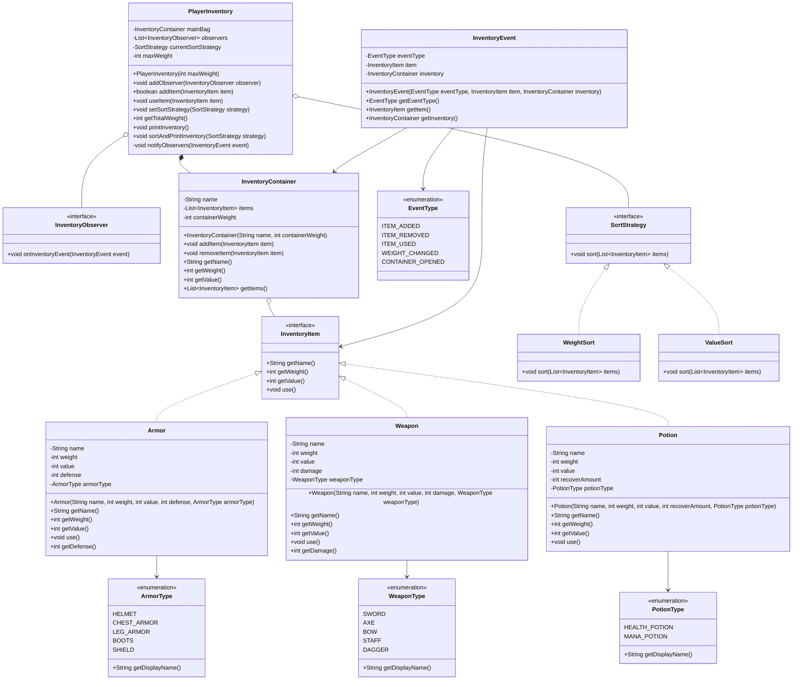

```mermaid
classDiagram
%% Interfaces
class InventoryItem {
<<interface>>
+String getName()
+int getWeight()
+int getValue()
+void use()
}

    class InventoryObserver {
        <<interface>>
        +void onInventoryEvent(InventoryEvent event)
    }

    class SortStrategy {
        <<interface>>
        +void sort(List~InventoryItem~ items)
    }

    %% Enums
    class EventType {
        <<enumeration>>
        ITEM_ADDED
        ITEM_REMOVED
        ITEM_USED
        WEIGHT_CHANGED
        CONTAINER_OPENED
    }

    class ArmorType {
        <<enumeration>>
        HELMET
        CHEST_ARMOR
        LEG_ARMOR
        BOOTS
        SHIELD
        +String getDisplayName()
    }

    class WeaponType {
        <<enumeration>>
        SWORD
        AXE
        BOW
        STAFF
        DAGGER
        +String getDisplayName()
    }

    class PotionType {
        <<enumeration>>
        HEALTH_POTION
        MANA_POTION
        +String getDisplayName()
    }

    %% Core Classes
    class InventoryContainer {
        -String name
        -List~InventoryItem~ items
        -int containerWeight
        +InventoryContainer(String name, int containerWeight)
        +void addItem(InventoryItem item)
        +void removeItem(InventoryItem item)
        +String getName()
        +int getWeight()
        +int getValue()
        +List~InventoryItem~ getItems()
    }

    class InventoryEvent {
        -EventType eventType
        -InventoryItem item
        -InventoryContainer inventory
        +InventoryEvent(EventType eventType, InventoryItem item, InventoryContainer inventory)
        +EventType getEventType()
        +InventoryItem getItem()
        +InventoryContainer getInventory()
    }

    class PlayerInventory {
        -InventoryContainer mainBag
        -List~InventoryObserver~ observers
        -SortStrategy currentSortStrategy
        -int maxWeight
        +PlayerInventory(int maxWeight)
        +void addObserver(InventoryObserver observer)
        +boolean addItem(InventoryItem item)
        +void useItem(InventoryItem item)
        +void setSortStrategy(SortStrategy strategy)
        +int getTotalWeight()
        +void printInventory()
        +void sortAndPrintInventory(SortStrategy strategy)
        -void notifyObservers(InventoryEvent event)
    }

    %% Item Classes
    class Armor {
        -String name
        -int weight
        -int value
        -int defense
        -ArmorType armorType
        +Armor(String name, int weight, int value, int defense, ArmorType armorType)
        +String getName()
        +int getWeight()
        +int getValue()
        +void use()
        +int getDefense()
    }

    class Weapon {
        -String name
        -int weight
        -int value
        -int damage
        -WeaponType weaponType
        +Weapon(String name, int weight, int value, int damage, WeaponType weaponType)
        +String getName()
        +int getWeight()
        +int getValue()
        +void use()
        +int getDamage()
    }

    class Potion {
        -String name
        -int weight
        -int value
        -int recoverAmount
        -PotionType potionType
        +Potion(String name, int weight, int value, int recoverAmount, PotionType potionType)
        +String getName()
        +int getWeight()
        +int getValue()
        +void use()
    }

    %% Sort Strategy Classes
    class WeightSort {
        +void sort(List~InventoryItem~ items)
    }

    class ValueSort {
        +void sort(List~InventoryItem~ items)
    }

    %% Implementation Relationships
    InventoryItem <|.. Armor
    InventoryItem <|.. Weapon
    InventoryItem <|.. Potion

    SortStrategy <|.. WeightSort
    SortStrategy <|.. ValueSort

    %% Composition and Association Relationships
    PlayerInventory *-- InventoryContainer
    InventoryContainer o-- InventoryItem
    PlayerInventory o-- SortStrategy
    PlayerInventory o-- InventoryObserver

    InventoryEvent --> InventoryItem
    InventoryEvent --> InventoryContainer
    InventoryEvent --> EventType

    Armor --> ArmorType
    Weapon --> WeaponType
    Potion --> PotionType
```